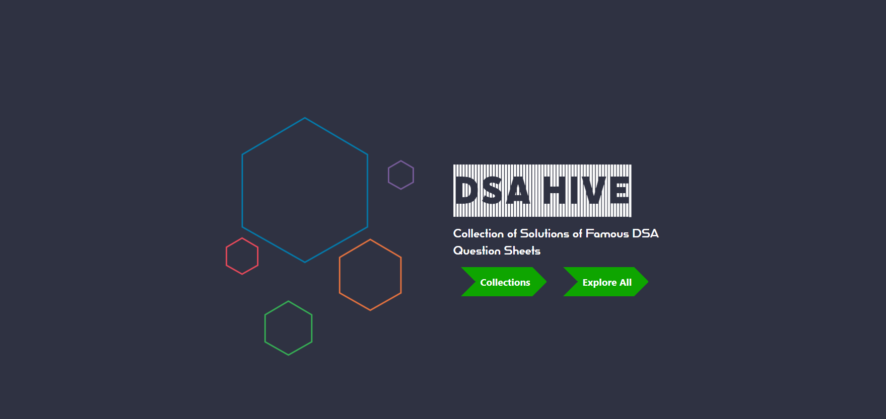

# DSA HIVE

## Description

The project is basically a collection of Famous DSA questions , sollutions along with suitable youtube links.
This shall be considered as a great resource for learning DSA .

### `Tech Stacks`

ReactJs
Material-Ui
Bootsrap

### `Guidelines`

->Cloning the repository in to your local machine.
->npm install
->npm start

# Developers

[Soham Chakraborty](https://soham-official.github.io/).

[Srinjoy Pal](https://www.linkedin.com/in/srinjoy-pal-36a076183/).

[Prarthita Samaddar](https://www.linkedin.com/in/prarthita-samadder-4371461bb/).
